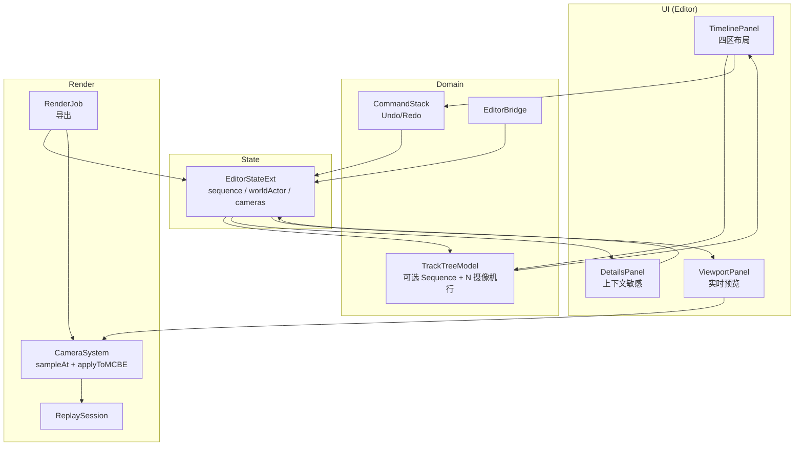

# 09 · 视频编辑工作流（简化摄像机时间轴模型）

> 入口：`src/playback/refactor/video-editing/`
> 角色：把"以视频轨为中心"的多剪辑模型改为以**摄像机轨**为中心的工作流：每台摄像机一条轨，摄像机序列按需出现，世界Actor 只作为后台回放源。时间轴沿用 UE5 Sequencer 四区视觉（参考 `docs/refactor/08-sequencer-timeline-ui.md`），并明确多摄像机导出 = 按序列采集世界Actor 的镜头。
> 本文是**工作流单一权威说明**；[01](01-editor-architecture.md) / [04](04-video-editing.md) / [06](06-data-persistence.md) / [08](08-sequencer-timeline-ui.md) 均以本文为准。

## 一、需求（Requirements）

### 1.1 功能性需求

| ID | 需求 | 优先级 |
|---|---|---|
| VW-1 | 时间轴默认只显示 1 条摄像机轨，对应自动创建的自由摄像机 `Camera 1` | P0 |
| VW-2 | 每台 `CameraEntity` 在时间轴上有且仅有 1 条摄像机轨；轨道按 `cameras` 数组顺序显示 | P0 |
| VW-3 | **摄像机序列**是可选单行轨：用户可手动添加；摄像机数量从 1 增至 2 时自动添加 | P0 |
| VW-4 | 摄像机序列存在时连续填满时间轴，可被 split 为多段；每段绑定一台摄像机，未绑定时回退到列表中第 1 台 | P0 |
| VW-5 | 无摄像机序列时仅允许 1 台摄像机，预览与导出均使用该唯一摄像机；有序列时按序列段顺序预览与导出 | P0 |
| VW-6 | 多摄像机导出的最终视频由摄像机序列定义：序列决定镜头与硬切边界，WorldActor 决定时间轴到回放源 tick 的映射及画面内容 | P0 |
| VW-7 | **世界Actor** 即回放文件本体，只作为后台回放源、子Actor 容器与时间映射器，不在时间轴显示轨道或片段 | P0 |
| VW-8 | 世界Actor 保持时间轴到回放源 tick 的唯一映射；本次时间轴不提供其 split、trim 或变速编辑入口 | P0 |
| VW-9 | 世界Actor 解析出 N 个 **子Actor**，按**类别**（Default / Players / Creatures / Entities）折叠；UI 默认折叠，可在 Details 面板展开 | P0 |
| VW-10 | 可为**玩家 / 生物**等子Actor 一键 **"创建摄像机绑定"**；同一子Actor可创建多台具有不同视角参数的绑定摄像机，生成的摄像机属于"摄像机"组并自动出现在序列绑定列表中 | P0 |
| VW-11 | **摄像机**（Cameras）= 自动创建的默认 Camera、用户手动添加或由绑定生成的 Camera 实体；每条 Camera 在时间轴上是独立轨道（行） | P0 |
| VW-12 | 摄像机支持 4 种 kind：**Keyframe**（关键帧）/ **Path**（3D 样条）/ **Rig**（运动原语）/ **Preset**（预设） | P0 |
| VW-13 | 摄像机支持**关键帧**编辑：插值（position / rotation / fov）、easing、关键帧 CRUD | P0 |
| VW-14 | Details 面板对世界Actor 内部的子Actor 提供**属性编辑**（位置、状态、装备、绑定等） | P1 |
| VW-15 | 所有编辑操作可 **Undo / Redo** | P0 |
| VW-16 | 所有数据持久化到 `.playback` 的 `editor` 节点 | P0 |
| VW-17 | 时间轴采用 UE5 Sequencer 四区布局（参考图风格）：顶工具栏 / 左侧导航 / 右侧画布 / 底部传输栏 | P0 |

### 1.2 非功能性需求

- **轨道数上限**：0..1 条摄像机序列 + 1..16 条摄像机；WorldActor 不占时间轴行
- **摄像机序列段数**：≤ 256
- **世界Actor 段数**：≤ 32
- **关键帧 / 路径点**：单摄像机 ≤ 1024
- **Undo 栈**：≤ 100 步
- **预览帧率**：编辑器内实时预览 ≥ 30 FPS（1080p 视口）
- **导出帧率**：由 [05-render-pipeline](05-render-pipeline.md) 保证
- **字体**：参考 [01 §1.2](01-editor-architecture.md) 最小 14px；本工作流 UI 沿用 `kFontScaleSmall/Body/Large`（18/24/30px）三档

### 1.3 与现有约束对齐

- 数据模型与序列化：复用 [06](06-data-persistence.md) 的 nlohmann::json 通道；新增结构并入 `PlaybackMeta.editor`
- 状态机：复用旧 [EditorContext](../editor/context/EditorContext.md) 与新 [EditorStateExt](01-editor-architecture.md) 字段
- 编辑器骨架：复用 [01](01-editor-architecture.md) 的 4 面板 + 2 分隔条 + 2 页面（Edit/Render）
- Sequencer 视觉：复用 [08](08-sequencer-timeline-ui.md) 的四区布局与共享轨道行模型
- 摄影机算法：复用 [02](02-camera-motion.md) 的采样 / 关键帧 / 样条 / Rig / 绑定阻尼实现

## 二、架构（Architecture）

### 2.1 时间轴布局（参考 UE5 Sequencer）

```
+-- 顶工具栏（38px）：时间码 · 撤销/重做 · 吸附 · 缩放 · 视图选项 --+
|  00:01:23.456 / 00:05:00.000  |  [↶] [↷]  [⚲]  [- 1x +]  [⚙]    |
+-- 左侧导航（260px） -----+-- 时间轴画布（剩余） ---------------+
| [搜索] [+ Add Sequence]   | 标尺 0:00  0:30  1:00  1:30  2:00   |
| ▾ Camera Sequence (可选)  |==================================== |
|   [bind] Segment A (Cam1) | [== Segment A ==][Seg B][=== C ===]|
| ▾ Cameras (N)             |                                      |
|   [icon] Camera 1         | ===●=====●=====●=====●=====●===     |
|   [icon] Camera 2         | ======●=====●=====●====              |
+---------------------------+--------------------------------------+
+-- 传输栏（34px）：[⏮] [◀] [▶/⏸] [▶] [⏭]  1.0x  [↻] ------------+
```

> **关键视觉规则**：
> - 摄像机序列（S）= 可选顶轨；手动添加或第二台 Camera 创建时出现，分段颜色按绑定摄像机着色。
> - 世界Actor（W）= 后台回放源，不显示为时间轴轨或段。
> - 摄像机（C）= 每台 Camera 一条轨；默认自动创建 `Camera 1`，因此至少 1 条。
> - 画布只画"轨道本身 + 段/关键帧/Marker"；子Actor 列表**不**展开成新轨道，**只在 Details 面板**。

### 2.2 三大条目数据模型

```cpp
// models/SequenceSegment.h
// 摄像机序列的一段：连续填满 [sequenceStartTick, sequenceEndTick] 范围内的一段时间
struct SequenceSegment {
    std::string id;                  // uuid
    int         startTick{};         // 在时间轴上的起点
    int         endTick{};           // 在时间轴上的终点
    std::string cameraId;            // 绑定的 Camera id；空 = 列表中第 1 台
    Color4      color{0.20f, 0.55f, 0.95f, 1.0f};  // 默认蓝
    bool        locked{};
};

// models/WorldActorSegment.h
// 世界Actor 的一段：默认整条填满；可 split / trim 后产生多段
struct WorldActorSegment {
    std::string id;                  // uuid
    int         startTick{};         // 在时间轴上的起点
    int         endTick{};           // 在时间轴上的终点
    int         sourceTick{};        // 对应回放源 tick
    float       speed{1.0f};         // 段内播放速度
    Color4      color{0.95f, 0.55f, 0.20f, 1.0f};  // 默认橙
    bool        locked{};
};

// models/CameraEntity.h
// 一台"摄像机"：可由用户手动添加，也可由"创建摄像机绑定"自动生成
// 4 种 kind 复用 02-camera-motion.md 的 CameraTrackExt（含 CameraPath / CameraRig / CameraPreset / Keyframe）
struct CameraEntity {
    std::string id;                  // uuid
    std::string name;                // 人类可读
    CameraKind  kind{CameraKind::Keyframe};
    std::vector<CameraKeyframe> keys;          // kind=Keyframe
    std::optional<CameraPath>     path;        // kind=Path
    std::optional<CameraRig>      rig;         // kind=Rig
    std::optional<CameraPreset>   preset;      // kind=Preset
    std::optional<CameraShake>    shake;       // 任意 kind 可叠
    std::optional<CameraLimiter>  limiter;     // 限位
    std::string  bindingEntityUuid;            // 绑定的子Actor（玩家/生物/实体）；空 = 自由机位
    int          bindingMode{0};               // 0=无 1=位置 2=角度 3=全
    float        bindingDamping{0.1f};
    bool         active{false};                // 当前激活（详情面板 / 当前显示 gizmo）
    bool         locked{};
};

// models/WorldActor.h
// 世界Actor（回放文件本体）+ 解析出的子Actor
struct WorldActor {
    std::string id;                  // 与 .playback 文件同 id
    std::string name;                // 回放名
    int         totalTicks{};        // 总时长
    std::vector<WorldActorSegment> segments;  // 段（默认 1 段 = 整条）
    std::vector<SubActor>           subActors; // 解析出的子Actor
};

// models/SubActor.h
// 解析自世界Actor 的一个内部实体
struct SubActor {
    std::string id;                  // uuid（来自 .playback）
    std::string name;
    SubActorCategory category{SubActorCategory::Default};  // Default/Players/Creatures/Entities
    Vec3        position{};
    Vec2        rotation{};
    // 详情面板可改的 agent 字段（按 category 决定具体 schema）
    nlohmann::json agentDetails;     // 自由结构，按 category 决定 key
    // 关联：同一子Actor可被多台不同视角的 Camera 绑定
    std::vector<std::string> boundCameraIds;
};
```

**关键不变量**：

- `sequence` 不存在或首尾相接覆盖 `[0, totalTicks]`，无空隙、无重叠；split 只拆分当前段。
- 用户删除 Sequence 时清空 `sequence`；其存在时 trim 调整当前段与相邻段共享边界，不能产生空隙或重叠。
- `WorldActorSegment` 是时间轴到回放源 tick 的唯一映射器：`sourceTick + floor((timelineTick - startTick) * speed)`；摄像机序列不重映射回放时间。
- `SequenceSegment.cameraId == ""` 时回退到 `Cameras[0]`，渲染层兜底，不抛错。
- `cameras` 始终至少包含 `Camera 1`；删除前需保证至少保留一台 Camera。摄像机数量从 1 增至 2 时自动建立默认 Sequence；自动建立的 Sequence 以后不会因摄像机数量降回 1 而自动删除。
- `CameraEntity.bindingEntityUuid != ""` 时该 Camera 是"绑定子Actor 的"；一个子Actor可关联多台 Camera，UI 上显示 `[bound]` 角标。

### 2.3 `EditorStateExt`（扩展）

```cpp
// models/EditorStateExt.h
struct EditorStateExt {
    int version{3};
    // 既有字段（保留）
    std::string projectName;
    std::string projectPath;
    int   currentTick{};
    int   totalTicks{};
    bool  playing{};
    float playbackSpeed{1.0f};

    // ====== 简化时间轴：可选序列 + 摄像机轨 ======
    WorldActor worldActor;                            // 后台回放源，不生成时间轴行
    std::vector<SequenceSegment> sequence;            // 可选顶轨（空或连续 1+ 段）
    std::vector<CameraEntity>    cameras;             // 每台一行（1..N，默认 Camera 1）
    int activeCameraIndex{};                          // 当前激活的 Camera（详情面板）

    // 既有字段：Marker 仍可独立存在（不绑定任何条目）
    std::vector<Marker> markers;

    // 既有字段：性能
    float fps{60.0f};
    size_t memoryUsageBytes{};
};
```

> **删除项**：`EditorStateExt.videoTracks`、`cameraTracks`、`transitions` 与旧 `Track / Clip / Transition` 模型整体下线。Sequence 存在时其段之间只支持硬切，由可选序列轨的内部段显式表达。

### 2.4 `TrackTreeModel`（统一轨道行）

复用 [08 §2.1](08-sequencer-timeline-ui.md) 的 `TrackTreeModel`，但**行集合**为按需 Sequence 加上每台 Camera：

```cpp
// models/TrackTreeModel.h
struct VisibleRow {
    enum class Kind { Sequence, Camera };
    Kind        kind;
    std::string id;             // sequence / camera
    std::string name;
    int         subIndex{-1};   // 仅 Camera: 索引
    bool        active{};
    bool        locked{};
};

class TrackTreeModel {
public:
    void rebuild(const EditorStateExt& s);
    std::vector<VisibleRow> rows() const;  // 顺序：Sequence（存在时）→ Cameras
};
```

> **子Actor 不产生行**。`Default / Players / Creatures / Entities` 类别在 Details 面板以**树形列表**展开，不污染画布。

### 2.5 三大条目的编辑操作（命令模式）

| 轨道 | 操作 | 命令 | 数据变化 |
|---|---|---|---|
| 摄像机序列 | 在 playhead 切 | `SplitSequenceAtPlayhead` | `sequence` 插入新 `SequenceSegment` |
| 摄像机序列 | 段 trim in/out | `TrimSequenceSegment` | 调整与相邻段共享的 `startTick/endTick` 边界 |
| 摄像机序列 | 段绑摄像机 | `BindSequenceToCamera` | 改 `segment.cameraId` |
| 摄像机序列 | 段删 | `DeleteSequenceSegment` | 段移除（左右两段合并） |
| 摄像机序列 | 手动添加 / 删除 | `AddCameraSequence` / `DeleteCameraSequence` | 建立默认连续段 / 清空 `sequence` |
| 摄像机 | 新建自由机位 | `AddFreeCamera` | `cameras` push 一台 |
| 摄像机 | 子Actor 创建绑定 | `CreateBindingCamera` | `cameras` push + `subActor.boundCameraIds` 追加，可重复创建不同视角 |
| 摄像机 | 加关键帧 | `AddKeyframe` | `camera.keys` push |
| 摄像机 | 关键帧 CRUD | `MoveKeyframe/DeleteKeyframe/SetKeyframeEasing` | 改 `keys` |
| 摄像机 | 改 kind | `SetCameraKind` | 改 `camera.kind` / `path/rig/preset` |
| 摄像机 | 解绑 | `UnbindCamera` | 清 `bindingEntityUuid/bindingMode` |
| 摄像机 | 删 | `DeleteCamera` | `cameras` erase（同时清空相关 sequence 段绑定） |
| 子Actor | 改属性 | `SetSubActorDetails` | 改 `subActor.agentDetails` |

**Undo/Redo** 复用 [01 §2.13](01-editor-architecture.md) 的 `CommandStack`；命令 execute / undo 互逆（[04 §2.7](04-video-editing.md)）。

### 2.6 Details 面板上下文（按选中刷新）

| 选中 | 渲染内容 | 字段 |
|---|---|---|
| 无 | 空状态 + 提示 | — |
| 序列（无段选） | 序列总览 | 段数、绑定覆盖率、警告（"X 段未绑定 Camera"） |
| 序列段 | 段属性 | startTick / endTick / cameraId（下拉）/ locked |
| WorldActor | 子Actor 树（按类别折叠） | Default / Players / Creatures / Entities；不对应时间轴行 |
| 子Actor | 子Actor 详情 | name / category（不可改）/ position / rotation / agentDetails（按类别动态字段）/ `[创建摄像机绑定]` 按钮 |
| Camera | 摄影机总览 | name / kind / bindingEntityUuid / bindingMode / damping / 关键帧列表 |
| 关键帧 | 关键帧属性 | tick / position / rotation / fov / easing |
| Marker | 标记属性 | label / tick / color / note |

### 2.7 导出（File > Export…）语义

**核心：单摄像机直接采集，多摄像机沿摄像机序列采集世界Actor**。

```cpp
// 伪代码
RenderJob::runExport(EditorStateExt& e) {
    for (int frame = 0; frame < totalFrames; ++frame) {
        int timelineTick = exportStartTick + (frame * ticksPerSecond) / exportFps;

        // 1) 单摄像机直用；多摄像机由当前 SequenceSegment 选择
        const SequenceSegment* seg = findSegmentAt(e.sequence, timelineTick);
        const CameraEntity* cam = seg
            ? findCameraById(e.cameras, seg->cameraId)
            : &e.cameras[0];
        if (!cam) cam = &e.cameras[0];

        // 3) 世界Actor 是唯一时间映射器
        int sourceTick = WorldActorOps::mapTimelineToSourceTick(e.worldActor, timelineTick);

        // 4) 让 WorldActor 跳到 sourceTick
        replaySession.requestSeek(sourceTick);
        replaySession.tick();

        // 5) 让 CameraSystem 采样该 Camera
        CameraSample s = CameraSystem::getInstance().sampleAt(cam, sourceTick, replaySession);

        // 6) 应用到 MCBE + 抓帧
        CameraSystem::applyToMCBE(s);
        captureFrame();
    }
}
```

> 与旧 "Clip.activeCameraTrackIdx 切轨" 模式**完全替换**：旧模式一个 Clip 用一个 trackIdx，新模式**序列段直接绑 Camera**。旧文档 [04 §2.10](04-video-editing.md) 与 [02 §2.3](02-camera-motion.md) 中 `activeCameraTrackIdx` 字段在新工作流里**不存在**。

### 2.8 实时预览（编辑时）

```cpp
// 选中"摄像机序列"时，每帧：
PreviewEngine::previewSequenceTick(EditorStateExt& e, int timelineTick) {
    const SequenceSegment* seg = findSegmentAt(e.sequence, timelineTick);
    const CameraEntity*    cam = resolveCamera(e.cameras, seg->cameraId);
    int sourceTick = WorldActorOps::mapTimelineToSourceTick(e.worldActor, timelineTick);

    replaySession.requestSeek(sourceTick);
    replaySession.tick();
    applyCameraToViewport(cam, sourceTick);  // 不导出，仅 ViewportPanel 用
}
```

> **默认预览**：无 Sequence 时使用唯一 Camera；有 Sequence 时由 Sequence 驱动。要“单独预览某台 Camera”时，选中 Camera 自身即可。

### 2.9 数据流图



## 三、执行（Execution）

### 3.1 任务拆分

| # | 文件 | 内容 | 验证 |
|---|---|---|---|
| 1 | `models/SequenceSegment.h` | 摄像机序列段模型 + 序列化 | 编译 |
| 2 | `models/WorldActorSegment.h` | 世界Actor 后台时间映射模型 + 序列化 | 编译 |
| 3 | `models/CameraEntity.h` | 摄像机实体（取代旧 CameraTrackExt 在 UI 层的位置） | 编译 |
| 4 | `models/SubActor.h` | 子Actor 模型 + 类别枚举 | 编译 |
| 5 | `models/WorldActor.h` | 世界Actor 容器（解析自 .playback） | 编译 |
| 6 | `models/EditorStateExt.h` | 增 sequence / worldActor / cameras；移除旧 videoTracks / cameraTracks | 编译 + 旧数据回退 |
| 7 | `models/TrackTreeModel.{h,cpp}` | 可选 Sequence + 每台 Camera 一行；移除 WorldActor 行 | 单测：rebuild 后行集合 |
| 8 | `panels/TimelinePanel.cpp` | 渲染可选 Sequence + 摄像机轨 + 关键帧；删除 WorldActor 轨逻辑 | 手动：UI 正确 |
| 9 | `panels/DetailsPanel.cpp` | 序列/序列段/WorldActor/子Actor/Camera/关键帧/Marker 上下文 | 手动：每个上下文 |
| 10 | `panels/ViewportPanel.cpp` | 默认从 sequence 驱动；选中 Camera 时直接用该 Camera | 手动：预览切换 |
| 11 | `panels/SubActorTree.{h,cpp}`（新） | 子Actor 按类别折叠树 | 手动：折叠展开 |
| 12 | `commands/SequenceCommands.{h,cpp}` | Split/Trim/Bind/Delete/Speed | 单测：execute/undo |
| 13 | `commands/WorldActorCommands.{h,cpp}` | Split/Trim/Speed/Ripple | 单测：execute/undo |
| 14 | `commands/CameraCommands.{h,cpp}` | AddFree/CreateBinding/Keyframe CRUD/SetKind/Unbind/Delete | 单测：execute/undo |
| 15 | `commands/SubActorCommands.{h,cpp}` | SetDetails | 单测：execute/undo |
| 16 | `EditorBridge.{h,cpp}` | 同步 3 类条目到 ReplaySession | 单测：sync 正确 |
| 17 | `RealtimePreview.cpp` | 序列驱动预览（§2.8） | 手动：playhead 移动 |
| 18 | `RenderJob.cpp` | 沿序列导出（§2.7） | 手动：导出样片 |
| 19 | `06-data-persistence.md` | 增 SequenceSegment / WorldActor / SubActor 序列化 | 文档 + 单测 round-trip |
| 20 | `01-editor-architecture.md` | 改"5 轨" → "3 一级轨道 + N 摄像机"；Details 上下文列表更新 | 文档 |
| 21 | `08-sequencer-timeline-ui.md` | 轨道集合改 3+N | 文档 |
| 22 | `04-video-editing.md` | 全文按新工作流重写为本工作流的"剪辑操作"分支 | 文档 |

### 3.2 关键算法

**序列段查找（O(log n)）**：

```cpp
const SequenceSegment* findSegmentAt(const std::vector<SequenceSegment>& segs, int tick) {
    if (segs.empty()) return nullptr;
    auto it = std::upper_bound(segs.begin(), segs.end(), tick,
        [](int v, const SequenceSegment& s){ return v < s.startTick; });
    if (it == segs.begin()) return &segs.front();
    --it;
    return (tick < it->endTick) ? &*it : nullptr;
}
```

**删除段（保持覆盖）**：

```cpp
bool deleteSegment(std::vector<SequenceSegment>& segs, size_t index, int totalTicks) {
    if (segs.size() <= 1 || index >= segs.size()) return false;
    if (index == 0) segs[1].startTick = 0;
    else if (index + 1 == segs.size()) segs[index - 1].endTick = totalTicks;
    else segs[index - 1].endTick = segs[index + 1].startTick;
    segs.erase(segs.begin() + index);
    return true;
}
```

**创建子Actor 绑定**（从 WorldActor 解析出的玩家/生物一键生成 Camera）：

```cpp
CameraEntity createBindingCamera(const SubActor& actor, const EditorStateExt& e) {
    CameraEntity cam;
    cam.id = genUuid();
    cam.name = actor.name + " (bind)";
    cam.kind = CameraKind::Preset;
    cam.preset = CameraPreset{ /* PresetKind::FollowEntity, ... */ };
    cam.bindingEntityUuid = actor.id;
    cam.bindingMode = 3;  // 全跟随
    cam.bindingDamping = 0.15f;
    return cam;
}
```

### 3.3 关键不变量

1. **默认仅一条 Camera 轨**：自动创建 `Camera 1`；WorldActor 不显示为时间轴轨。
2. **Camera 一对一轨道**：`cameras` 中每台 Camera 只对应一条轨，且至少保留一台。
3. **Sequence 按需存在**：用户可手动添加 / 删除；第二台 Camera 创建时自动添加；自动添加后不随摄像机数量下降而删除。
4. **Sequence 存在时填满 [0, totalTicks]**：split 后所有段首尾相接，无空隙。
5. **单机位直出，多机位走 Sequence**：无 Sequence 时使用唯一 Camera；有 Sequence 时段未绑 Camera 兜底为 `cameras[0]`。
5. **子Actor 类别不可改**：解析自 .playback；UI 只读 category。
6. **绑定 Camera = cameras 成员**：用户加 Camera 时若选"绑定子Actor"，必须指定一个子Actor；同一子Actor可关联多台具有不同视角参数的 Camera。
7. **迁移版本明确**：无 `editor` 节点时重建 v3 默认模型；v1/v2 经迁移后加载；v3 校验加载；未知未来版本拒绝加载并显示错误。
8. **Command execute/undo 互逆**：undo 状态 = 执行前。
9. **TrackTreeModel 顺序固定**：Sequence（存在时）→ Cameras（按 cameras 数组顺序）→ Marker（存在时）。

### 3.4 测试用例

| ID | 用例 | 期望 |
|---|---|---|
| VW-T1 | 打开 .playback → 默认状态 | 自动创建 `Camera 1`；时间轴只显示其轨道；无 Sequence |
| VW-T2 | 单摄像机导出 | 不依赖 Sequence，直接使用 `Camera 1` |
| VW-T3 | split sequence at tick=1000 | 变 2 段 [0,1000) + [1000,totalTicks) |
| VW-T4 | trim worldActor 段边界 +20 | 相邻段共享边界同步移动，覆盖不变 |
| VW-T5 | 子Actor 树展开 Players | Details 面板出现按名字排序的玩家列表 |
| VW-T6 | 玩家连续两次创建不同视角绑定 | cameras 多 2 台；subActor.boundCameraIds 含两台 Camera id |
| VW-T7 | 添加第二台 Camera | 新 Camera 轨出现；自动建立连续的默认 Sequence |
| VW-T8 | 删除 Camera 至只剩一台 | 对应 Camera 轨移除；Sequence 保留，直到用户手动删除 |
| VW-T9 | 关键帧 CRUD | 关键帧点增删 + UI 重绘 |
| VW-T10 | Undo CreateBindingCamera | cameras 恢复；只移除本次写入的 subActor.boundCameraIds 项 |
| VW-T11 | 导出 = 沿序列渲染 | 导出视频按时序切镜头 |
| VW-T12 | 字体下限 14px | grep 自绘 Text 不低于 14 |
| VW-T13 | 旧 .playback（无 sequence/worldActor/cameras 字段）加载 | 重建：世界Actor 后台数据 + `Camera 1`，Sequence 为空 |

### 3.5 风险与回退

| 风险 | 缓解 |
|---|---|
| 子Actor 数量大（>500）树渲染卡 | 默认折叠；首次展开只渲染前 100 |
| 绑定 Camera 解绑后旧段无 Camera | 兜底 cameras[0] + UI 警告 |
| 旧 videoTracks 字段被移除，存档不可读 | 无 editor 节点重建默认；v1/v2 迁移为 v3；新存档不写旧字段 |
| 关键帧绑定 Camera id 在重命名后失效 | cameraId 用 uuid，不依赖 name |
| 时间轴到回放源 tick 映射不一致 | 预览、导出与 SequenceSampler 仅调用 `WorldActorOps::mapTimelineToSourceTick`，并验证 WorldActor 段覆盖全时间轴 |

## 四、模块关系

### 被谁调用（上游）

- **`panels/TimelinePanel`**：渲染可选 Sequence、Camera 轨与关键帧
- **`panels/DetailsPanel`**：上下文敏感字段编辑
- **`panels/ViewportPanel`**：默认从 sequence 驱动预览
- **`panels/SubActorTree`**（新）：子Actor 树
- **`EditorBridge`**：同步 3 类条目到 ReplaySession
- **`RealtimePreview`**：序列驱动预览
- **`RenderJob`**：沿序列导出
- **`CommandStack`**：包装所有 §2.5 命令

### 调用谁（下游）

- **[01](01-editor-architecture.md) EditorCore**：EditorStateExt / CommandStack
- **[02](02-camera-motion.md) CameraSystem**：sampleAt + applyToMCBE（不再用 `activeCameraTrackIdx`）
- **[05](05-render-pipeline.md) RenderJob / RealtimePreview**：读 sequence 与 worldActor
- **[06](06-data-persistence.md) PlaybackMeta.editor**：序列化 sequence / worldActor / cameras / subActors
- **旧 [EditorContext](../editor/context/EditorContext.md)**：通过 `EditorBridge` 通信

### 共享数据

- `EditorStateExt.sequence`：UI ↔ 渲染
- `EditorStateExt.worldActor`：UI ↔ 渲染
- `EditorStateExt.cameras`：UI ↔ 渲染
- `EditorStateExt.activeCameraIndex`：gizmo 高亮

### 事件订阅 / 发送

- `TrackTreeModel.onRebuilt` → TimelinePanel
- `CommandStack.onPushed/onUndo/onRedo` → StatusPanel
- `EditorBridge.onWorldActorChanged` → ViewportPanel（重置预览源）

## 五、阅读顺序

1. 本文件（工作流唯一权威）
2. [01](01-editor-architecture.md) — 编辑器骨架（4 面板 + 2 页面）
3. [08](08-sequencer-timeline-ui.md) — Sequencer 四区 UI
4. [02](02-camera-motion.md) — CameraSystem 算法
5. [04](04-video-editing.md) — 剪辑操作（与本文配套）
6. [05](05-render-pipeline.md) — 渲染消费
7. [06](06-data-persistence.md) — 数据模型与持久化

## 六、与 UE5 Sequencer 参考图的对应

| 参考图元素 | 本工作流 | 说明 |
|---|---|---|
| 顶工具栏 | 顶工具栏 | 时间码、撤销重做、缩放等 |
| `Shots` 组 | **摄像机序列** | 但每段强制绑 Camera（参考图里 `shot0010/0050/0020` 是镜头） |
| 左侧 Cameras | **世界Actor** | 在我们这里是"回放文件本体"，参考图里是"摄影机资产"；改名为 WorldActor 更准确 |
| `amEagle_BP / NS Blow Across Ground` | **子Actor**（Players / Creatures / Entities） | 这些是 sub-actor 类别下的实体 |
| `amEagle_cinematic_v124b_i14_ASE` | **关键帧 / 样条 / Rig** | Camera 的关键帧轨道 |
| 底部传输栏 | 传输栏 | 完全一致 |
| Marker 轨 | 顶部 Marker 轨（保留） | 与条目无关，独立轨 |

> **差异点（明确说明）**：
> 1. UE5 的 "Shots" 是离散镜头的容器；我们是"序列 = 顶轨 + 段"，效果相同。
> 2. UE5 的 Camera 资产在 ContentBrowser；我们没有内容浏览器，**子Actor 直接从 WorldActor 解析**，"创建绑定"生成 Camera。
> 3. UE5 的 Master Sequence / Sub Sequence 概念我们不引入，**只一条顶轨**。
