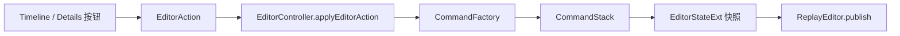

# 11 · UI 功能按钮补全（Timeline / Details）

> 角色：按 [09-video-editing-workflow.md](09-video-editing-workflow.md) §2.1 / §2.6 与 [08-sequencer-timeline-ui.md](08-sequencer-timeline-ui.md)，把 TimelinePanel 与 DetailsPanel 的功能按钮/控件**写完整**，所有已有可撤销操作经 `EditorAction → EditorController → CommandFactory → CommandStack` 提交，确保无 Bug；预览/导出/持久化等深度逻辑留待下一步。

## 一、需求（Requirements）

| ID | 需求 | 位置 |
|---|---|---|
| UI-1 | 顶工具栏按钮齐全：时间码、Undo/Redo、+Key、+Camera、Split、Del、吸附、缩放 | TimelinePanel |
| UI-2 | 轨道导航栏 4 组固定（Camera Sequence / World Actor / Cameras(N) / Markers），组可折叠，行可选中 | TimelinePanel |
| UI-3 | 画布空白处点击定位播放头；段/关键帧/Marker 命中、拖动 trim、吸附保持 | TimelinePanel |
| UI-4 | 传输栏：跳转开头、上一帧、播放/暂停、下一帧、跳转结尾、速度 −/＋、禁用态 Loop | TimelinePanel |
| UI-5 | Details 8 上下文齐全：无选中 / 序列 / 序列段 / 世界Actor / 世界Actor段 / 子Actor / Camera / 关键帧 / Marker | DetailsPanel |
| UI-6 | 子Actor 按 Default/Players/Creatures/Entities 四类折叠树，可选中，类别只读 | DetailsPanel |
| UI-7 | 序列段/世界Actor段支持 start/end 字段 trim、锁定禁用；世界Actor段支持变速 | DetailsPanel |
| UI-8 | 关键帧支持 easing 下拉（Linear/EaseIn/EaseOut/EaseInOut）、tick 移动、删除 | DetailsPanel |
| UI-9 | 无后端能力（Marker 删除、关键帧值、绑定参数等）显示禁用态/只读，不伪造本地业务状态 | DetailsPanel |
| UI-10 | 所有可提交按钮走命令链；拖动类字段提交时机为释放/失焦，避免每帧压 Undo 栈 | 全局 |
| UI-11 | 时间轴采用紧凑扁平 Sequencer：透明图标按钮仅悬停变白；底部左侧传输控制、右侧独立水平滚动条；缩放位于顶部左侧 | TimelinePanel |
| UI-12 | 一级轨道只显示 Camera Sequence、World Actor、Cameras；Sequence 为灰白、World Actor 为低饱和绿、Camera 为低饱和紫；蓝色 Add 与圆角搜索框并列 | TimelinePanel |

## 二、架构（Architecture）

### 2.1 命令链

### 2.2 新增动作（本模块为打通按钮补充后端最小路由）

| 动作 | 工厂方法 | 说明 |
|---|---|---|
| `SetKeyframeEasing` | `createSetKeyframeEasing(id, keyframeId, EasingType)` | 关键帧 easing 下拉 |
| `SetSubActorDetails` | `createSetSubActorDetails(subActorId, AgentDetails)` | 子Actor agentDetails 编辑，新增 `EditorAction.details` 字段 |

### 2.3 模块边界

| 模块 | 输入 | 输出 |
|---|---|---|
| `TimelinePanel` | `EditorStateExt`、Selection、view prefs | 四区 UI + EditorAction |
| `DetailsPanel` | `EditorStateExt`、Selection | 8 上下文表单 + EditorAction |
| `EditorController` | EditorAction 队列 | 命令栈提交 + 状态发布 |
| `TrackTreeModel` | `EditorStateExt` | 可见轨道行（4 组） |

## 三、执行（Execution）

1. `EditorAction.h`：新增 `SetKeyframeEasing` 枚举与 `details` 载荷字段。
2. `EditorController.cpp`：路由 `SetKeyframeEasing` / `SetSubActorDetails`。
3. `TimelinePanel`：工具栏补 Split/Del；导航栏 4 组头 + 折叠切换；画布空白 seek；传输栏速度 −/＋。
4. `DetailsPanel`：按 8 上下文补齐绘制与按钮（序列绑定概览、段 trim 字段、子Actor 四类树、agentDetails 编辑、关键帧 easing 下拉、Marker 只读页等）。
5. 验证：`xmake build playback`、`xmake build refactor-model-tests`、`git diff --check`。
